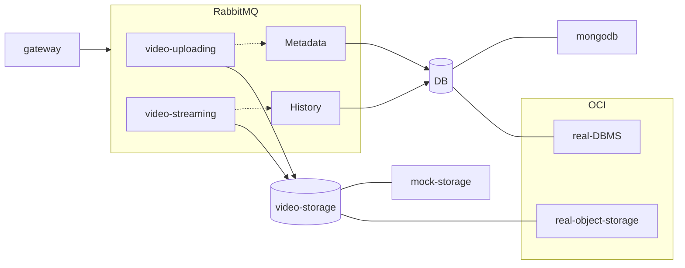
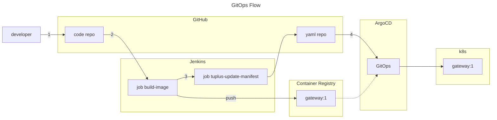

# Architecture



## Frontend

- gateway

## Backend

- video-streaming / video-uploading \
  -> video-storage: Mock Storage (local) / Real Storage (OCI Object Storage)

- metadata / history \
  -> db: MongoDB (local) / Real DB (OCI DB)

- RabbitMQ

<br>

# Development Environment (Local)

## Prerequisite

- Docker
- Docker Compose

## Run

```bash
docker-compose up --build -d
```

## Stop

```bash
docker-compose down -v
```

## Access

- Gateway: http://localhost:4000

# Deployment (OCI)

chmod +x ./scripts/cd/infrastructure.sh
./scripts/cd/infrastructure.sh

cat ~/.kube/free-k8s-config-seoul | base64 | pbcopy

github -> settings -> secrets ->
KUBE_CONFIG
CONTAINER_REGISTRY
REGISTRY_UN
REGISTRY_PW
COMPARTMENT_ID
BUCKET_NAME
NAMESPACE

OCI_CONFIG
OKE_CLUSTER_OCID
OCI_CLI_USER
OCI_CLI_TENANCY
OCI_CLI_FINGERPRINT
OCI_CLI_KEY_CONTENT
OCI_CLI_REGION
OKE_CLUSTER_OCID

<br>
<br>

# CI/CD
