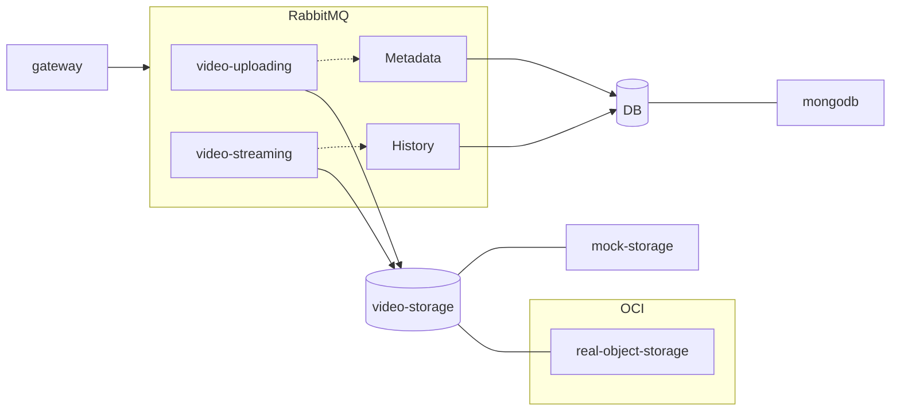
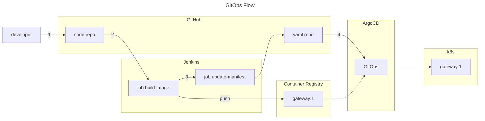

# Architecture


## Frontend

- gateway

## Backend

- video-streaming / video-uploading \
  -- video-storage: Mock Storage / Real Storage(Azure Object Storage)

- metadata / history \
  -- db: MongoDB 

- RabbitMQ

<br>
<br>
<br>

# Development Environment
## Prerequisite

- Docker
- Docker Compose

## Up
```bash
./_up.sh
```

## Down
```bash
./_down.sh
```

## Access
- Gateway: http://localhost:4000

<br>
<br>
<br>

# Deploy to k8s
## [Azure k8s](./readme/README-azure-k8s.md)

## k8sAzure Container Registry
Add k8s secret
```bash
Outputs:
registry_hostname = "<DOCKER_SERVER>"
..
registry_pw = <sensitive>
registry_un = "<REGISTRY_USERNAME>"

➜  terraform output -raw registry_pw
<REGISTRY_PASSWORD>

➜  kubectl --kubeconfig kubeconfig -n tuplus -- create secret docker-registry azure-registry-secret \ 
--docker-server=<DOCKER_SERVER> --docker-username='<REGISTRY_USERNAME>' \ 
--docker-password='<REGISTRY_PASSWORD>' --
```

## Azure Object Storage 
Add k8s secret
```bash
➜  terraform output -raw storage_account_connection_string
AccountName=<STORAGE_ACCOUNT_NAME>;AccountKey=<STORAGE_ACCESS_KEY>;...

➜  echo -n <STORAGE_ACCOUNT_NAME> | base64
<STORAGE_ACCOUNT_NAME_BASE64>

➜  echo -n <STORAGE_ACCESS_KEY> | base64
<STORAGE_ACCESS_KEY_BASE64>

➜  cat <<EOT > storage-azure-secret.yaml
apiVersion: v1
kind: Secret
metadata:
  name: storage-azure-secret
  namespace: tuplus
type: Opaque
data:
  STORAGE_ACCOUNT_NAME: <STORAGE_ACCOUNT_NAME_BASE64>
  STORAGE_ACCESS_KEY: <STORAGE_ACCESS_KEY_BASE64>
EOT

➜   kubectl --kubeconfig kubeconfig apply -f storage-azure-secret.yaml
```

<br>
<br>
<br>

# CI/CD


For more information about GitOps Automation, Check [My Blog](https://blog.code-lab.kr).
