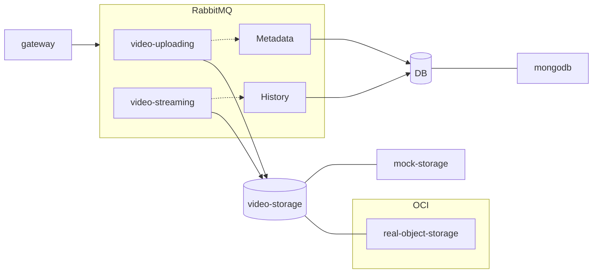
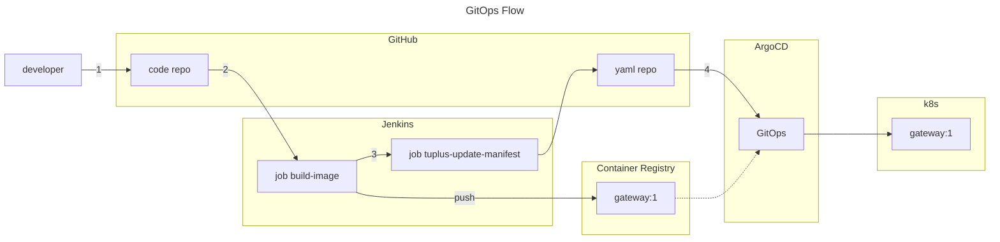

# Architecture


## Frontend

- gateway

## Backend

- video-streaming / video-uploading \
  -- video-storage: Mock Storage / Real Storage (Azure Object Storage)

- metadata / history \
  -- db: MongoDB 

- RabbitMQ

<br>
<br>
<br>

# Development Environment
## Prerequisite

- Docker
- Docker Compose

## Up
```bash
./_up.sh
```

## Down
```bash
./_down.sh
```

## Access
- Gateway: http://localhost:4000

<br>
<br>
<br>

# Deploy to k8s
## [Azure k8s](./readme/README-azure-k8s.md)

## Azure Container Registry
```bash
mkdir -pv security/tettaform/azure
vi .env
STORAGE_ACCESS_KEY=<STORAGE_ACCESS_KEY>
```

<br>
<br>
<br>

# CI/CD
