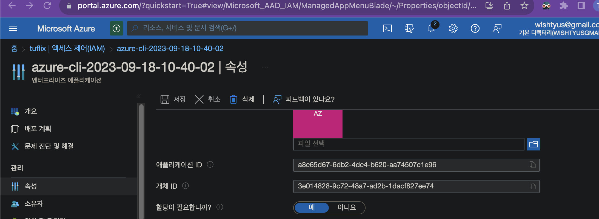

# Install
### Terraform
https://developer.hashicorp.com/terraform/downloads
```bash
# for Mac
➜  brew tap hashicorp/tap
➜  brew install hashicorp/tap/terraform

# for Ubuntu
➜  wget -O- https://apt.releases.hashicorp.com/gpg | sudo gpg --dearmor -o /usr/share/keyrings/hashicorp-archive-keyring.gpg
➜  echo "deb [signed-by=/usr/share/keyrings/hashicorp-archive-keyring.gpg] https://apt.releases.hashicorp.com $(lsb_release -cs) main" | sudo tee /etc/apt/sources.list.d/hashicorp.list
➜  sudo apt update && sudo apt install terraform

➜  terraform version 
Terraform v1.5.7
on darwin_arm64
```

### Azure CLI 
https://learn.microsoft.com/ko-kr/cli/azure/install-azure-cli
```bash
# for Mac
➜  brew update && brew install azure-cli

# for Ubuntu
curl -sL https://aka.ms/InstallAzureCLIDeb | sudo bash

➜  az login

# 권한부여
➜  export MSYS_NO_PATHCONV=1   
➜  az ad sp create-for-rbac \
  --name free-pricipal
  --role="Contributor" \
  --role="User Access Administrator" \
  --scopes="/subscriptions/<구독ID>"
  {
  "appId": "a8c...",
  "displayName": "azure-cli-2023-09-18-10-40-02",
  "password": "Ge....",
  "tenant": "85..."
}

# role "User Access Administrator" 
➜  az role assignment create --assignee <principalId/개체ID> --role <roleDefinitionId> --scope /subscriptions/<구독ID>/resourceGroups/tuplus
...
➜  az provider register -n Microsoft.ContainerService
```




# Terraform apply
```bash
➜  terraform init
➜  terraform plan
➜  terraform apply
...
Outputs:

registry_hostname = "tuplus.azurecr.io"
registry_id = "/subscriptions/78c4440c-2050-4d5a-93f3-e30263f35cd9/resourceGroups/tuplus/providers/Microsoft.ContainerRegistry/registries/tuplus"
registry_pw = <sensitive>
registry_un = "tuplus"
storage_account_connection_string = <sensitive>


# registry_pw
➜  terraform output -raw registry_pw
➜  az acr credential show --name tuplus --output table


# storage_account_connection_string
➜  terraform output -raw storage_account_connection_string
➜  az acr credential show --name tuplus --output table


# get node
➜  kubectl get nodes --kubeconfig kubeconfig
NAME                              STATUS   ROLES   AGE     VERSION
aks-default-23725562-vmss000000   Ready    agent   2m13s   v1.27.3
aks-default-23725562-vmss000001   Ready    agent   2m25s   v1.27.3

# get all
➜  kubectl get all --kubeconfig kubeconfig -A
NAMESPACE     NAME                                      READY   STATUS    RESTARTS   AGE
kube-system   pod/azure-ip-masq-agent-hkpqg             1/1     Running   0          24m
kube-system   pod/azure-ip-masq-agent-pvspw             1/1     Running   0          24m
kube-system   pod/cloud-node-manager-2mtnx              1/1     Running   0          24m
kube-system   pod/cloud-node-manager-hnvrp              1/1     Running   0          24m
kube-system   pod/coredns-789789675-wqb7r               1/1     Running   0          24m
kube-system   pod/coredns-789789675-x2ssh               1/1     Running   0          23m
kube-system   pod/coredns-autoscaler-649b947bbd-q5jmg   1/1     Running   0          24m
kube-system   pod/csi-azuredisk-node-8jnkw              3/3     Running   0          24m
kube-system   pod/csi-azuredisk-node-w7sdd              3/3     Running   0          24m
kube-system   pod/csi-azurefile-node-fc424              3/3     Running   0          24m
kube-system   pod/csi-azurefile-node-hmqts              3/3     Running   0          24m
kube-system   pod/konnectivity-agent-6c6b9bfc8b-tjlr8   1/1     Running   0          14m
kube-system   pod/konnectivity-agent-6c6b9bfc8b-vc29x   1/1     Running   0          14m
kube-system   pod/kube-proxy-8c78w                      1/1     Running   0          24m
kube-system   pod/kube-proxy-hh5xf                      1/1     Running   0          24m
kube-system   pod/metrics-server-5955767688-5bgk7       2/2     Running   0          23m
kube-system   pod/metrics-server-5955767688-5tdlf       2/2     Running   0          23m

NAMESPACE     NAME                     TYPE        CLUSTER-IP     EXTERNAL-IP   PORT(S)         AGE
default       service/kubernetes       ClusterIP   10.0.0.1       <none>        443/TCP         24m
kube-system   service/kube-dns         ClusterIP   10.0.0.10      <none>        53/UDP,53/TCP   24m
kube-system   service/metrics-server   ClusterIP   10.0.161.135   <none>        443/TCP         24m

NAMESPACE     NAME                                        DESIRED   CURRENT   READY   UP-TO-DATE   AVAILABLE   NODE SELECTOR   AGE
kube-system   daemonset.apps/azure-ip-masq-agent          2         2         2       2            2           <none>          24m
kube-system   daemonset.apps/cloud-node-manager           2         2         2       2            2           <none>          24m
kube-system   daemonset.apps/cloud-node-manager-windows   0         0         0       0            0           <none>          24m
kube-system   daemonset.apps/csi-azuredisk-node           2         2         2       2            2           <none>          24m
kube-system   daemonset.apps/csi-azuredisk-node-win       0         0         0       0            0           <none>          24m
kube-system   daemonset.apps/csi-azurefile-node           2         2         2       2            2           <none>          24m
kube-system   daemonset.apps/csi-azurefile-node-win       0         0         0       0            0           <none>          24m
kube-system   daemonset.apps/kube-proxy                   2         2         2       2            2           <none>          24m

NAMESPACE     NAME                                 READY   UP-TO-DATE   AVAILABLE   AGE
kube-system   deployment.apps/coredns              2/2     2            2           24m
kube-system   deployment.apps/coredns-autoscaler   1/1     1            1           24m
kube-system   deployment.apps/konnectivity-agent   2/2     2            2           24m
kube-system   deployment.apps/metrics-server       2/2     2            2           24m

NAMESPACE     NAME                                            DESIRED   CURRENT   READY   AGE
kube-system   replicaset.apps/coredns-789789675               2         2         2       24m
kube-system   replicaset.apps/coredns-autoscaler-649b947bbd   1         1         1       24m
kube-system   replicaset.apps/konnectivity-agent-6c6b9bfc8b   2         2         2       14m
kube-system   replicaset.apps/konnectivity-agent-7dc986dbcc   0         0         0       24m
kube-system   replicaset.apps/metrics-server-5955767688       2         2         2       23m
kube-system   replicaset.apps/metrics-server-7557c5798        0         0         0       24m
```